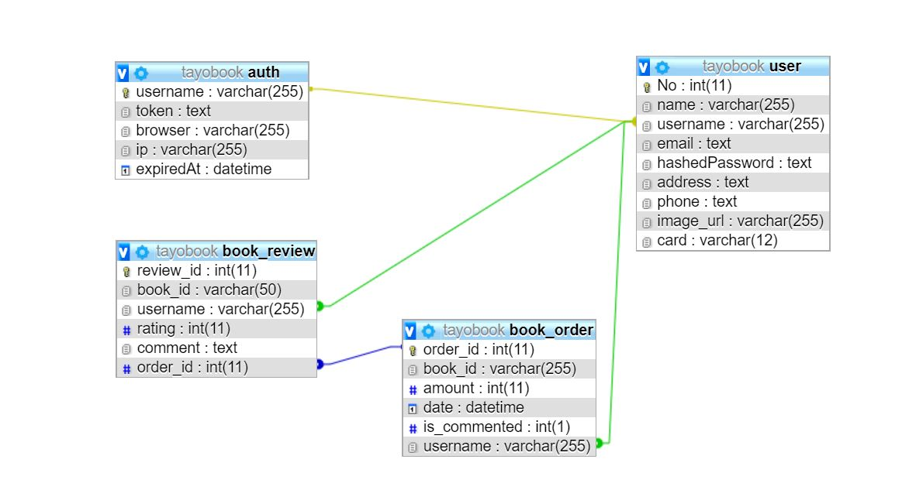
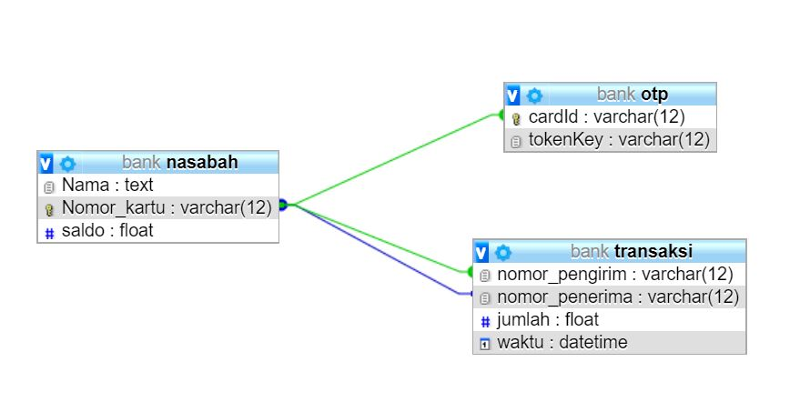
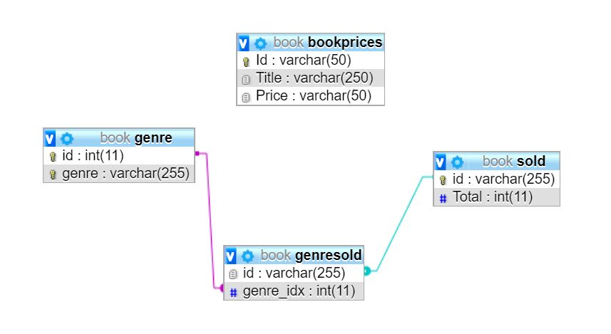

# Pro-Books: Online Bookstore

A website for book e-commerce written in plain PHP and Javascript for application, using SOAP as book web service written in Java and RESTFUL as bank web service written in Node.JS.

## Basis Data

### Pro-book

Pada basis data pro-book, terdapat tabel:

1. Auth

    Untuk menyimpan access token
    
2. User

    Untuk menyimpan data pengguna
    
3. Book_order

    Untuk menyimpan data pembelian buku
    
4. Book_review

    Untuk menyimpan review dari buku yang telah dibeli

### Web Service Bank

Pada basis data web service bank, terdapat tabel:

1. Nasabah

    Untuk menyimpan akun nasabah pengguna beserta nomor kartu dan saldo
    
2. Transaksi

    Untuk menyimpan data transaksi transfer antara satu akun nasabah dengan akun nasabah lain
    
3. OTP

    Untuk menyimpan kode otp untuk transaksi

### Web Service Book

Pada basis data web service book, terdapat tabel:

1. Bookprices

    Untuk menyimpan data harga buku
    
2. Genre

    Untuk menyimpan data genre-genre buku yang ada
    
3. Sold

    Untuk menyimpan data buku yang telah terjual beserta jumlahnya
    
4. Genresold

    Untuk menyimpan data buku beserta genrenya (foreign key ke `Genre`)

## Konsep Shared Session dengan REST

## Mekanisme Pembangkitan Token dan Expiry Time

## Kelebihan dan Kelemahan Arsitektur Aplikasi Dibandingkan Aplikasi Monolitik

### Kelebihan

1. Penggunaan web service memiliki organisasi aplikasi yang lebih baik daripada monolitik sebab setiap webservice memiliki fungsi yang spesifik (dalam aplikasi ini terdapat webservice buku dan bank secara terpisah)
2. Penggunaan web service memiliki coupling yang rendah, sehingga mudah untuk dilakukan development secara terpisah (pada monolitik couplingnya tinggi)
3. Pengembangan aplikasi dengan web service lebih mudah dan cepat serta memiliki tingkat kesulitan men-debug lebih rendah dibandingkan dengan aplikasi monolitik
4. Web service yang dibuat dapat dipergunakan kembali

### Kelemahan

1. Penggunaan aplikasi dengan web service mengharuskan deployment terhadap masing-masing web service, sehingga perlu dilakukan monitoring dan testing terhadap masing-masing service yang pada aplikasi monolitik hanya perlu dilakukan satu kali deployment
2. Aplikasi dengan web service memiliki kinerja yang bisa jadi lebih lambat dibanding aplikasi monolitik sebab harus melakukan request ke web service terlebih dahulu

[DELIVERABLE] Berikan penjelasan mengenai hal di bawah ini pada bagian **Penjelasan** dari *readme* repository git Anda:
    - Basis data dari sistem yang Anda buat, yaitu basis data aplkasi pro-book, webservice bank, dan webservice buku.
    - Konsep *shared session* dengan menggunakan REST.
    - Mekanisme pembangkitan token dan expiry time pada aplikasi Anda.
    - Kelebihan dan kelemahan dari arsitektur aplikasi tugas ini, dibandingkan dengan aplikasi monolitik (login, CRUD DB, dll jadi dalam satu aplikasi)

## Pembagian Tugas

**Contributors**
1. Ayrton Cyril / 13516019
2. Jessin Donnyson / 13516117
3. Nicholas Wijaya / 13516121

REST :
1. Validasi nomor kartu : 13516019
2. Transfer             : 13516121
3. Transfer with HTOP   : 13516117

SOAP :
1. Search Book          : 13516117
2. Book recommendation  : 13516121
3. Buy book             : 13516019

Perubahan Web app :
1. Halaman Search       : 13516121
2. Halaman Register     : 13516019
3. Halaman Detail       : 13516121
4. Halaman Edit Profile : 13516019
5. Halaman Profile      : 13516019
6. Halaman History      : 13516019
7. Halaman Review       : 13516019
8. Book Recommendation  : 13516121
9. Modal HTOP           : 13516117

Bonus :
1. Pembangkitan token HTOP/TOTP : 13516117
2. Validasi token               : 13516117